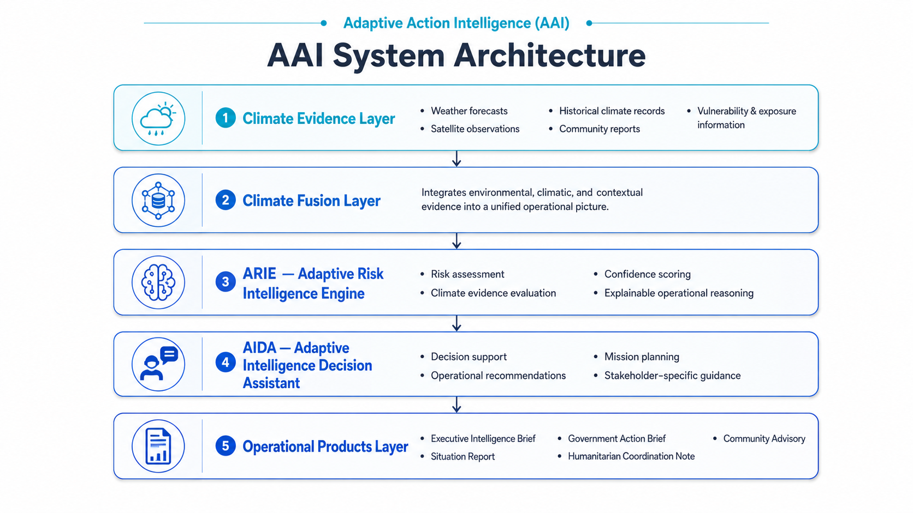
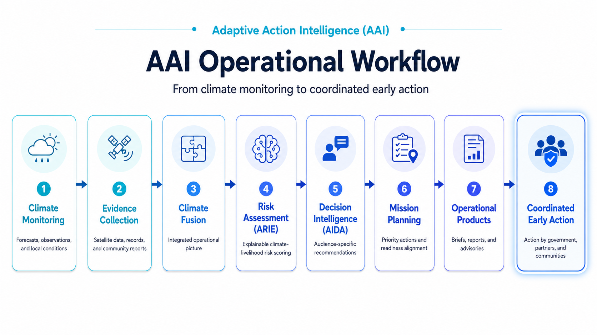

# 🌍 Adaptive Action Intelligence (AAI)

## Turning Climate Early Warning into Coordinated Early Action

### An Open Operational Intelligence Platform for Climate Early Warning–to–Early Action Decision Support

<p align="center">

> **Adaptive Action Intelligence (AAI)** transforms climate information into explainable operational intelligence that helps governments, humanitarian organizations, and communities make timely, evidence-based decisions.

</p>

<p align="center">


</p>

---

> 📌 **Mission:** Transform climate information into actionable operational intelligence that enables faster, more transparent, and better-coordinated climate action.

> 🌍 **Built for:** IGAD / ICPAC Early Warning–to–Early Action Hackathon

---

> ****

---

# 📖 Executive Summary

Climate information has advanced significantly through improved forecasting, satellite observations, and environmental monitoring. Yet one critical challenge remains: transforming early warning into coordinated early action.

Adaptive Action Intelligence (AAI) was developed to bridge this operational gap. Rather than functioning as another weather dashboard, AAI integrates climate evidence, adaptive risk assessment, mission management, and explainable decision support into a unified operational intelligence platform.

AAI is designed to help decision-makers understand evolving climate risks, evaluate operational readiness, prioritize response options, and generate audience-specific intelligence products that support coordinated action across government institutions, humanitarian organizations, and vulnerable communities.

The platform is built around six operational questions that guide every assessment:

- **What is happening?**
- **Why is it happening?**
- **How serious is it?**
- **What should be done?**
- **Who should act?**
- **What outcome is expected?**

By answering these questions through an integrated intelligence workflow, AAI supports the transition from monitoring climate hazards to enabling informed, evidence-based decisions.

---

# 🚀 Why Adaptive Action Intelligence?

Traditional climate information systems provide valuable forecasts and hazard monitoring. However, decision-makers often need more than data—they need operational intelligence that explains the implications of climate risks and supports coordinated action.

AAI was designed to complement existing climate services by providing an operational layer that transforms climate evidence into explainable, mission-oriented decision support.

| Traditional Early Warning Systems | Adaptive Action Intelligence |
|-----------------------------------|------------------------------|
| Focus on hazard monitoring | Focus on operational decision support |
| Display forecasts and observations | Explain risks, impacts, and recommended actions |
| Static dashboards | Mission-driven operational intelligence |
| Generic alerts | Audience-specific recommendations |
| Separate reports and products | Integrated operational workflow |
| Technical information | Explainable intelligence for decision-makers |

Rather than replacing existing forecasting systems, AAI builds upon them by helping organizations answer the operational question that often follows every forecast:

> **"Now that we know this risk exists, what should we do next?"**

---

# 🌎 The Operational Challenge

Across many regions, climate information is increasingly available through national meteorological services, regional climate centers, satellite observations, and forecasting platforms. Despite these advances, transforming available information into coordinated action remains a persistent challenge.

Operational decision-making often requires combining multiple sources of evidence, assessing uncertainty, understanding local vulnerability, prioritizing competing risks, and communicating recommendations to different audiences—all within limited time.

As a result, organizations frequently face challenges such as:

- Fragmented climate and contextual information.
- Limited operational interpretation of forecasts.
- Inconsistent decision support across institutions.
- Difficulty translating technical information into practical actions.
- Multiple stakeholders receiving different products without a unified operational picture.

Adaptive Action Intelligence addresses these challenges by integrating climate evidence, explainable risk assessment, mission management, and operational product generation into a single intelligence workflow that supports timely, transparent, and coordinated decision-making.

---
# 🧠 Solution Overview

Adaptive Action Intelligence (AAI) is built around a modular operational intelligence framework that transforms climate information into coordinated decision support.

Instead of treating forecasts as the final product, AAI treats climate information as the starting point of an operational reasoning process. Multiple sources of evidence are synthesized, interpreted, and translated into audience-specific intelligence products that support timely and transparent decision-making.

The platform is organized into five interconnected operational layers:

1. **Climate Evidence Layer** – Collects and integrates climate observations, forecasts, and contextual information.
2. **Climate Fusion Layer** – Combines multiple evidence sources into a unified operational picture.
3. **Adaptive Risk Intelligence Engine (ARIE)** – Produces explainable risk assessments and operational priorities.
4. **Adaptive Intelligence Decision Assistant (AIDA)** – Converts technical intelligence into actionable recommendations.
5. **Operational Products Layer** – Generates reports, advisories, and decision products tailored to different stakeholders.

This layered architecture enables AAI to move beyond hazard monitoring by supporting the complete decision-making process from evidence collection to coordinated early action.

---

# 🏗 Operational Intelligence Framework

The AAI architecture connects climate evidence, multi-source fusion, explainable risk assessment, decision assistance, and stakeholder-specific operational products within one traceable intelligence pipeline.



*Figure 1. Adaptive Action Intelligence system architecture, showing the progression from climate evidence to coordinated operational products.*
---

# 🔄 Operational Workflow

AAI follows a transparent operational workflow in which every recommendation can be traced from climate evidence through risk assessment, decision intelligence, mission planning, and coordinated early action.



*Figure 2. AAI operational workflow from climate monitoring and evidence collection to coordinated early action.*
---

# 🎯 Core Design Principles

The architecture of Adaptive Action Intelligence is guided by a set of operational design principles that emphasize transparency, usability, and practical decision support.

### Explainable Intelligence

Every assessment is supported by evidence, confidence indicators, and reasoning that users can inspect and understand.

### Operational Decision Support

The platform is designed to answer practical operational questions rather than simply displaying climate data.

### Modular Architecture

Each component performs a specific role, enabling the platform to evolve without requiring major redesigns.

### Human-Centred Intelligence

AAI is designed to augment human decision-making by providing interpretable recommendations rather than replacing expert judgment.

### Audience-Specific Communication

Different stakeholders require different information. AAI tailors operational products for government agencies, humanitarian organizations, and communities while maintaining a consistent evidence base.

### Early Warning to Early Action

The platform supports the complete operational journey—from detecting climate risks to enabling coordinated preparedness and response.

---
# 🚀 Platform Capabilities

Adaptive Action Intelligence (AAI) is organized around operational capabilities that work together to transform climate information into coordinated decision support. Each capability addresses a specific stage of the early warning–to–early action process while contributing to a unified operational picture.

---

## 🛰 Mission Control

> **The operational command center for climate intelligence.**

Mission Control provides decision-makers with a centralized workspace for monitoring missions, reviewing climate intelligence, assessing operational readiness, and accessing all major components of the platform.

### Key Capabilities

- Unified operational dashboard
- Mission status monitoring
- Intelligence overview
- Risk visualization
- Operational navigation
- Decision support entry point

 ** 
**

---

## 🧠 Adaptive Risk Intelligence Engine (ARIE)

> **Explainable climate risk intelligence for operational decision-making.**

ARIE evaluates climate evidence, contextual information, and operational indicators to generate transparent risk assessments. Every assessment is accompanied by confidence indicators and supporting evidence.

### Key Capabilities

- Explainable risk assessment
- Evidence-based reasoning
- Confidence scoring
- Adaptive operational prioritization
- Transparent intelligence generation

****

---

## 🌦 Climate Evidence

> **Transparent evidence supporting every operational assessment.**

Climate Evidence provides visibility into the scientific and contextual information used during intelligence generation, allowing users to understand the basis of each recommendation.

### Key Capabilities

- Evidence transparency
- Climate indicator summaries
- Contextual interpretation
- Explainable intelligence support

---

## 🔄 Climate Fusion Trace

> **Understanding how intelligence is produced.**

Climate Fusion Trace illustrates how multiple information sources are combined throughout the intelligence pipeline. Rather than presenting only a final result, it shows the reasoning process behind operational assessments.

### Key Capabilities

- Evidence integration
- Processing transparency
- Intelligence traceability
- Decision audit support

**
** 

---

## 📊 Adaptive Risk Index

> **A transparent operational prioritization framework.**

The Adaptive Risk Index summarizes multiple risk dimensions into a single operational indicator that supports prioritization and resource allocation while remaining interpretable.

### Key Capabilities

- Risk scoring
- Multi-factor assessment
- Operational prioritization
- Decision support visualization

---

## 🎯 Mission Readiness Assessment

> **Evaluating preparedness before action.**

Mission Readiness provides an overview of operational preparedness by evaluating key readiness indicators that influence response planning and coordination.

### Key Capabilities

- Preparedness assessment
- Operational readiness monitoring
- Decision confidence support
- Mission planning assistance

---

## 🤖 Adaptive Intelligence Decision Assistant (AIDA)

> **Transforming intelligence into actionable recommendations.**

AIDA converts operational intelligence into audience-specific recommendations that help different stakeholders understand what actions should be considered under current conditions.

### Key Capabilities

- Decision support
- Recommendation generation
- Audience-specific guidance
- Operational planning assistance

**
**

---

## 📑 Operational Products

> **Automatically generated intelligence products for multiple stakeholders.**

AAI produces operational products tailored to different audiences while maintaining a shared evidence base and consistent operational picture.

### Available Products

- Executive Intelligence Brief
- Situation Report
- Government Action Brief
- Humanitarian Coordination Note
- Community Advisory
- Operational Risk Summary

### Benefits

- Consistent messaging
- Audience-specific communication
- Rapid product generation
- Evidence-based reporting

**
** 

---

# 🖼 Dashboard Gallery

The following screenshots highlight the major operational components of Adaptive Action Intelligence.

| Mission Control | Situation Awareness |
|-----------------|---------------------|
|  |  |

| Climate Fusion | Decision Intelligence |
|----------------|-----------------------|
|  |  |

| AIDA Decision Partner | Operational Products |
|------------------------|----------------------|
|  |  |

> **Note:** Screenshots were captured from Version 1.0 of Adaptive Action Intelligence (AAI), developed for the IGAD / ICPAC Early Warning–to–Early Action Hackathon.

---
# 💻 Technology Stack

Adaptive Action Intelligence (AAI) is built using a modern, modular web technology stack designed for scalability, maintainability, and operational decision support.

## Frontend

| Technology | Purpose |
|------------|---------|
| **Next.js 16** | Full-stack React framework |
| **React 19** | Interactive user interface |
| **TypeScript** | Type-safe application development |
| **Tailwind CSS** | Utility-first responsive styling |
| **Leaflet** | Interactive geospatial visualization |

---

## Intelligence Layer

| Component | Purpose |
|-----------|---------|
| **ARIE** | Adaptive Risk Intelligence Engine |
| **AIDA** | Adaptive Intelligence Decision Assistant |
| **Climate Fusion Layer** | Multi-source evidence integration |
| **Decision Engine** | Operational reasoning and recommendations |
| **Operational Product Generator** | Audience-specific intelligence products |

---

## Climate Intelligence

The current prototype demonstrates the operational intelligence workflow using representative climate information and modular data services.

The architecture is designed to support integration with operational climate services, including:

- National Meteorological Services
- Regional Climate Centres
- Satellite observations
- Climate databases
- Community observations
- Impact reports

Future releases will support real-time data integration through modular service connectors.

---

## User Experience

AAI has been designed around operational usability rather than technical complexity.

Key interface characteristics include:

- Responsive dashboard layout
- Explainable intelligence panels
- Mission-oriented navigation
- Audience-focused reporting
- Interactive operational products

---

# 🏛 Project Architecture

AAI follows a modular architecture where each component has a clearly defined responsibility.

```text
src/
│
├── app/
│   ├── Mission pages
│   ├── Dashboard routing
│   └── Application entry
│
├── components/
│   ├── Mission Control
│   ├── ARIE Components
│   ├── AIDA Components
│   ├── Reports
│   ├── Maps
│   ├── Layout
│   └── UI Components
│
├── lib/
│   ├── Intelligence Engine
│   ├── Climate Fusion
│   ├── Decision Support
│   └── Risk Assessment
│
├── services/
│   ├── Climate Services
│   ├── Report Generation
│   └── Data Processing
│
├── types/
│
└── utils/
```

### Design Philosophy

The project architecture follows four guiding principles:

- Modular design
- Single responsibility
- Explainable intelligence
- Extensible operational workflow

This approach enables individual components to evolve independently while maintaining a consistent operational intelligence framework.

---

# 📂 Repository Structure

```text
Adaptive-Action-Intelligence/
│
├── public/
│
├── src/
│   ├── app/
│   ├── components/
│   ├── lib/
│   ├── services/
│   ├── styles/
│   ├── types/
│   └── utils/
│
├── docs/
│   ├── assets/
│   ├── architecture/
│   └── screenshots/
│
├── package.json
├── tsconfig.json
├── next.config.ts
└── README.md
```

---

# 🚀 Getting Started

## Clone the Repository

```bash
git clone https://github.com/<your-username>/adaptive-action-intelligence.git

cd adaptive-action-intelligence
```

---

## Install Dependencies

```bash
npm install
```

---

## Start the Development Server

```bash
npm run dev
```

The application will be available at:

```
http://localhost:3000
```

---

## Build for Production

```bash
npm run build
```

---

## Start the Production Server

```bash
npm start
```

---

# ⚙ Configuration

AAI has been designed to support modular integration with climate information services and external data providers.

Configuration options may include:

- Climate data services
- API endpoints
- Geospatial layers
- Report templates
- Operational thresholds

As the platform evolves, these services can be configured independently without requiring changes to the core operational workflow.

---

# 🔐 Design Considerations

AAI was developed with several engineering priorities in mind:

- Explainable intelligence rather than black-box recommendations.
- Modular architecture to support future extensions.
- Operational workflows that align with climate risk management practice.
- Clear separation between user interface, intelligence logic, and reporting components.
- Scalable foundation for integration with real-time climate information services.

These principles ensure that the platform remains adaptable while supporting transparent and evidence-based operational decision-making.

---
# 🗺 Roadmap

Adaptive Action Intelligence is being developed as a modular operational intelligence platform that can evolve from a hackathon prototype into a deployable decision-support system.

| Version | Milestone | Status |
|----------|-----------|:------:|
| **v1.0** | Interactive prototype with Mission Control, ARIE, AIDA, Climate Fusion, Operational Products, and Executive Intelligence Brief | ✅ Completed |
| **v1.1** | Live climate service integration and configurable data connectors | 🔄 Planned |
| **v1.2** | Multi-hazard operational assessments (drought, flood, heatwaves) | 🔄 Planned |
| **v2.0** | Multi-country deployment and regional climate intelligence | 🎯 Vision |
| **v3.0** | Operational decision-support platform for national institutions and humanitarian partners | 🚀 Long-Term Vision |

---

# 🤝 Contributing

Adaptive Action Intelligence is an evolving research and development project.

We welcome constructive feedback, technical contributions, research collaboration, and operational partnerships that strengthen climate resilience and early action.

Potential areas for collaboration include:

- Climate services integration
- Geospatial analytics
- Artificial intelligence for decision support
- Humanitarian information management
- Early warning systems
- Risk communication
- Operational dashboard development
- User experience and accessibility
- Scientific validation and evaluation

If you have ideas or would like to collaborate, feel free to open an issue or submit a pull request.

---

# 📚 Citation

If you use Adaptive Action Intelligence (AAI) in research, presentations, or derivative work, please cite the repository.

```text
Ismail, A. H., & Muhumed, R. H. (2026).
Adaptive Action Intelligence (AAI):
An Operational Intelligence Platform for Climate Early Warning–to–Early Action Decision Support.
GitHub Repository.
```

*A formal software citation and DOI may be added in future releases.*

---

# 👥 Project Team

## Ahmed Hussein Ismail

**Founder & Project Lead**

Ahmed leads the vision, system architecture, operational intelligence framework, climate risk analytics, and platform development for Adaptive Action Intelligence. His work focuses on bridging climate science, operational decision support, and early warning–to–early action systems through explainable intelligence and geospatial analytics.

**Areas of expertise**

- Climate Intelligence
- Agro-Meteorology
- Climate Risk Analytics
- GIS & Remote Sensing
- Early Warning Systems
- Decision Support Systems
- Climate Information Services

---

## Rehana Hassan Muhumed

**Frontend Engineer & UI/UX Developer**

Rehana leads frontend implementation and user experience development, translating operational concepts into responsive, intuitive interfaces that support effective decision-making and usability across the platform.

**Areas of expertise**

- Frontend Engineering
- React & Next.js
- User Interface Design
- User Experience
- Dashboard Development
- Responsive Web Applications

---

# 🏆 Acknowledgements

Adaptive Action Intelligence was developed as part of the **IGAD / ICPAC Early Warning–to–Early Action Hackathon**.

The project is inspired by the growing need to strengthen the connection between climate science, operational decision-making, and coordinated climate action.

We acknowledge the important contributions of the climate services, disaster risk management, humanitarian, and research communities whose work continues to advance climate resilience across the Greater Horn of Africa and beyond.

---

# 📄 License

This project is released under the **MIT License**.

You are free to use, modify, and distribute this software in accordance with the terms of the license.

See the `LICENSE` file for details.

---

# 🌍 Vision

Adaptive Action Intelligence is founded on a simple idea:

**Climate information creates value only when it enables better decisions.**

AAI is designed to bridge the gap between scientific knowledge and operational action by transforming climate information into explainable, transparent, and audience-specific intelligence.

Rather than replacing existing climate services, AAI complements them by providing an operational layer that helps decision-makers understand evolving risks, prioritize actions, and coordinate responses across institutions and communities.

Our long-term vision is to support a future where climate early warning is consistently translated into timely, evidence-based, and coordinated early action—strengthening resilience, protecting livelihoods, and improving preparedness for climate-related hazards.

---

<div align="center">

### Adaptive Action Intelligence (AAI)

**Turning Climate Early Warning into Coordinated Early Action**

*Building operational intelligence for a more climate-resilient future.*

© 2026 Adaptive Action Intelligence Project

</div>
