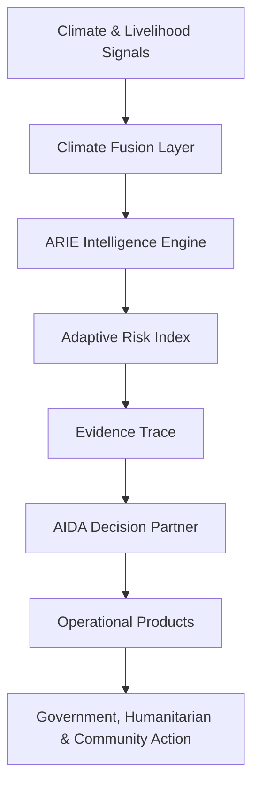

# Adaptive Action Intelligence (AAI)

## Dashboard

**Transforming climate intelligence into coordinated early action through explainable AI.**

Adaptive Action Intelligence (AAI) is a climate decision-support platform built for the IGAD/ICPAC Early Warning–Early Action Hackathon. It transforms climate signals, livelihood stress, exposure, coping pressure, and coordination readiness into explainable operational decisions for governments, humanitarian partners, and communities.

AAI is designed around one core question:

> When climate risk is rising, who should act, what should they do, and how can the warning reach communities in time?

---

## Problem

In climate-vulnerable dryland contexts such as Somaliland and Somalia, early warning information often exists, but it does not always translate into timely action.

Common gaps include:

- Forecasts are too technical for community-level use.
- Risk information is not always connected to livelihood realities.
- Government, humanitarian, and community actors may not receive the same operating picture.
- Warnings may arrive before decisions are clear.
- Last-mile communication through trusted local channels is often weak.

AAI addresses this gap by converting early warning information into operational action intelligence.

---

## Solution

AAI provides a working prototype of an adaptive early warning–to–early action intelligence system.

It combines:

1. **ARIE — Adaptive Risk Intelligence Engine**  
   A rules-based reasoning engine that calculates explainable climate-livelihood risk.

2. **Climate Fusion Layer**  
   A context layer that adjusts risk interpretation using livelihood sensitivity, exposure, coordination readiness, and last-mile communication logic.

3. **AIDA — Adaptive Intelligence Decision Assistant**  
   A communication layer that translates ARIE outputs into audience-specific briefs.

4. **Operational Products Generator**  
   A product layer that generates structured outputs such as Situation Reports, Government Action Notes, Humanitarian Coordination Notes, Community Advisories, and Somali last-mile messages.

---
## Key Capabilities

- AI-powered operational risk assessment
- Explainable decision intelligence (ARIE)
- Audience-specific operational brief generation (AIDA)
- Climate-livelihood fusion analytics
- Mission-based operational workflow
- Operational product generation
- Somali last-mile communication support

## Current Demo Scenarios

AAI currently includes two operational demo scenarios:

### 1. Gabiley Drought Watch

Focus: dryland farming and agro-pastoral livelihoods.

Key concerns:

- Rainfall deficit
- Soil moisture stress
- Water-point pressure
- Crop planting uncertainty
- Market sensitivity
- Last-mile advisory delivery

### 2. Togdheer Pastoral Stress

Focus: mobile pastoral livelihoods and pastoral movement corridors.

Key concerns:

- Pasture deterioration
- Water scarcity
- Borehole congestion
- Livestock body condition
- Movement toward alternative grazing areas
- Humanitarian coordination readiness

---

## Core Features

### ARIE Intelligence Console

The ARIE console shows:

- Operational scenario
- Risk score
- Risk level
- Risk trend
- Recommended decision
- Risk drivers
- Evidence trace
- Decision confidence
- Expected operational outcomes

---

### Adaptive Risk Index

AAI converts multiple stress signals into a composite operational risk score.

The current model considers:

- Rainfall deficit
- Temperature stress
- Water stress
- Pasture stress
- Market stress
- Livelihood exposure
- Coping pressure
- Coordination readiness

The score is translated into practical decision modes:

- Routine Monitoring
- Preparedness Monitoring
- Enhanced Watch
- Emergency Activation

---

### Climate Fusion Trace

AAI does not hide the reasoning process.

The Climate Fusion Trace shows:

- What baseline inputs were adjusted
- Why they were adjusted
- Which livelihood profile influenced the change
- Which signals were used
- What field verification is still needed
- Which last-mile channels should be used

This makes the platform explainable and challengeable by field teams.

---

### AIDA Decision Partner

AIDA translates ARIE intelligence into audience-specific communication.

Brief modes include:

- Executive brief
- Government brief
- Humanitarian coordination brief
- Community advisory
- Somali last-mile message

AIDA does not calculate risk. ARIE remains the reasoning engine. AIDA only communicates the risk in usable language.

---

### Operational Products

AAI generates ready-to-copy operational products:

- Situation Report
- Government Action Note
- Humanitarian Coordination Note
- Community Advisory
- Somali Last-Mile Message

These products are designed for coordination meetings, field validation, partner planning, and community communication.

---

## Demo Flow

A recommended demo flow:

1. Open the dashboard.
2. Review the Mission Control section.
3. Select an operational scenario in the ARIE console.
4. Review the Adaptive Risk Index.
5. Open the Climate Fusion Trace to see why the score changed.
6. Switch AIDA brief modes to show audience-specific communication.
7. Generate an Operational Product.
8. Copy the Somali last-mile message to show community usability.
9. Explain how the system supports early warning–to–early action coordination.

---

## Why AAI Is Different

AAI is not just a weather dashboard.

It connects:

- Climate risk
- Livelihood exposure
- Coping pressure
- Coordination readiness
- Field verification
- Last-mile communication
- Operational decision-making

The platform focuses on turning climate information into action, not only displaying data.

---

## Architecture

## Technology Stack

- Next.js 16
- React 19
- TypeScript
- Tailwind CSS
- Leaflet
- Open-Meteo API
- Lucide React

  src/
 ├── app/
 ├── components/
 ├── intelligence/
 │     ├── ARIE
 │     ├── AIDA
 │     └── Reports
 ├── lib/
 └── context/

git clone https://github.com/AhmedEid02/project-aai

cd project-aai

npm install

npm run dev

## Vision

AAI is designed as a foundation for next-generation Early Warning–to–Early Action systems across the IGAD region. Future work includes integrating real-time climate services, impact forecasting, geospatial analytics, multilingual communication, and operational coordination tools to strengthen anticipatory action and climate resilience.

## Team

Ahmed Hussein Ismail
Project Lead | Climate Intelligence | Agro-Meteorology | Early Warning | Geospatial Analytics

Rihana Hassan Muhumed 
Frontend Development | User Experience | Responsive Interface
